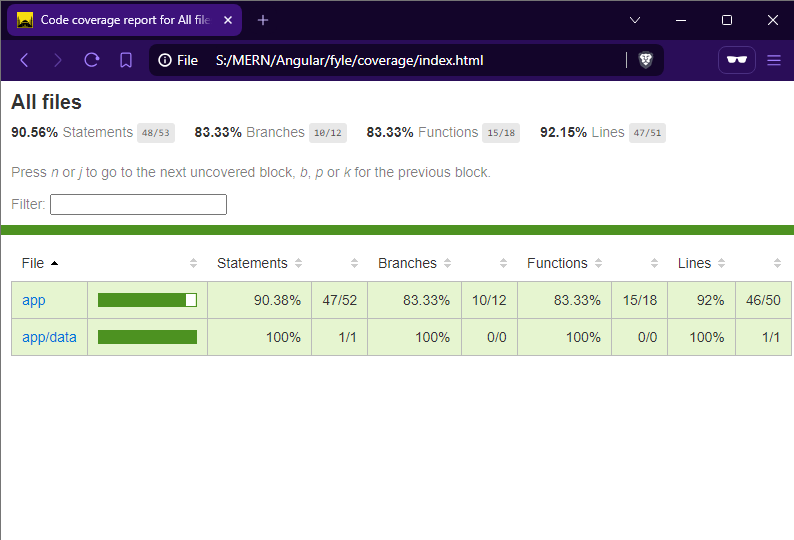
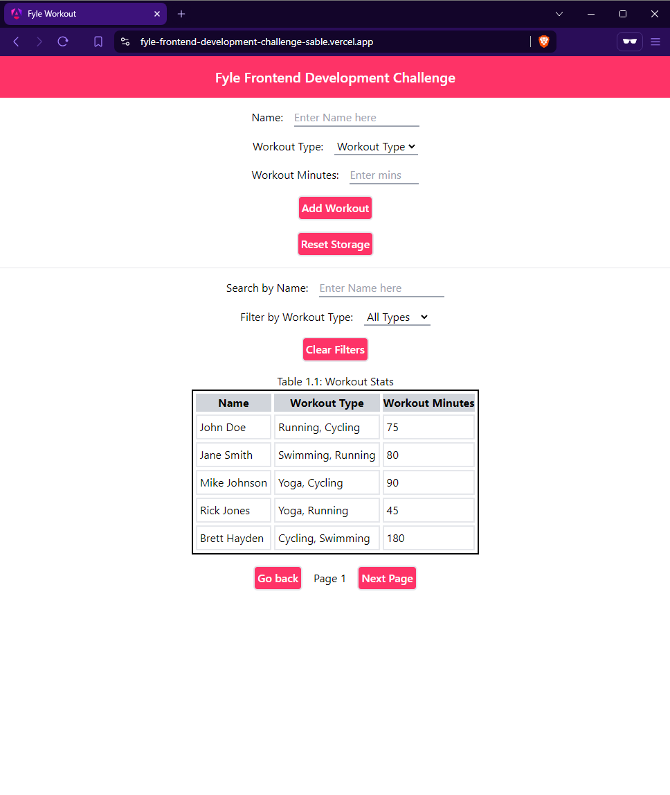

# Fyle Frontend Challenge

## Live here - https://fyle-frontend-development-challenge-sable.vercel.app/

[View Code Coverage Report](./coverage/index.html)

<h3>Code Coverage Report Snip</h3>


## Key Features
- Add user name and select workout type
- Add workout minutes for each user
- View workout history with user data
- Pagination implemented with a maximum of 5 rows per table page

## Short Description
This project is a workout system built using Angular and styled with Tailwind CSS. Users can enter their name, select a workout type, and add their workout minutes. The workout history displays all users in a table format, showing their names, workout types, and total workout minutes. Pagination is implemented to display a maximum of 5 rows per page in the table.

## Snippets
<h3>App Home</h3>


## Tech Used
- **Angular:** Frontend framework for building the application
- **Tailwind CSS:** Utility-first CSS framework for styling
- **Karma:** Test runner for unit testing
- **Jasmine:** Testing framework for JavaScript

## Running the Project Locally

### There are 2 ways to do this

1. **Using docker:**
   ```bash
   docker build . -t fyle-intern-challenge
   docker run -p 4200:4200 fyle-intern-challenge
2. **Clone the repository:**
   ```bash
   Install node version > 18
   git clone https://github.com/sarthakmishraa/fyle-FrontendDevelopmentChallenge.git
   cd fyle-FrontendDevelopmentChallenge
   Run npm install
   Run ng serve (to start dev server locally)